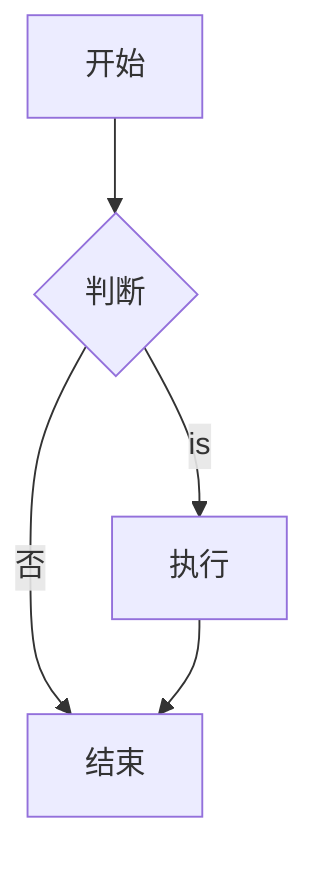

<Note icon="language" title="Original Chinese Content">
Parts of this page are still in their original Chinese. Key technical terms and concepts may be more intuitive in Chinese. [View the Chinese version →](/zh/env/markdown.md)
</Note>


# Markdown syntax

Markdown is a lightweight markup language，for formatting text。它simple and easy to learn，widely used for document writing、blogs、forums, etc.。

## Basic Syntax

### title

```markdown
# 一级title
## 二级title
### 三级title
#### 四级title
##### 五级title
###### 六级title
```

### 强调

```markdown
*斜体* 或 _斜体_
**粗体** 或 __粗体__
***粗斜体*** 或 ___粗斜体___
~~Removed线~~
```

效果：*斜体*、**粗体**、***粗斜体***、~~Removed线~~

### list

#### 无序list

```markdown
- 项目1
- 项目2
  - 子项目2.1
  - 子项目2.2
- 项目3

* 也可以用星号
+ 或者加号
```

#### 有序list

```markdown
1. 第一项
2. 第二项
3. 第三项
   1. 子项3.1
   2. 子项3.2
```

### Link

```markdown
[Link文本](https://example.com)
[带title的Link](https://example.com "鼠标悬停显示")

# 自动Link
<https://example.com>
<email@example.com>

# Reference式Link
[Link文本][ref]
[ref]: https://example.com
```

### 图片

```markdown


# 图片Link
[](https://example.com)
```

### Reference

```markdown
> 这is一段Reference
> 可以有多行

> 多级Reference
>> 第二级
>>> 第三级
```

### 代码

#### 行内代码

```markdown
使用 `反引号` Package裹代码
```

#### 代码块

````markdown
```python
def hello():
    print("Hello World")
```

```javascript
console.log("Hello World");
```
````

### 分割线

```markdown
---
***
___
```

---

### Table

```markdown
| 左对齐 | 居中 | 右对齐 |
|:-------|:----:|-------:|
| 内容1  | 内容2 | 内容3 |
| 内容4  | 内容5 | 内容6 |
```

| 左对齐 | 居中 | 右对齐 |
|:-------|:----:|-------:|
| 内容1  | 内容2 | 内容3 |

### Tasklist

```markdown
- [x] FinishedTask
- [ ] 未完成Task
- [ ] 另aTask
```

- [x] FinishedTask
- [ ] 未完成Task

### 脚注

```markdown
这is一段文字[^1]

[^1]: 这is脚注内容
```

## Github Flavored Markdown (GFM)

GitHub 对 Markdown 进行了Extension，增加了一些Features。

### syntax高亮

````markdown
```python
def hello():
    print("Hello")
```
````

### 表情符号

```markdown
:smile: :heart: :+1: :rocket:
```

:smile: :heart: :+1: :rocket:

[表情符号list](https://github.com/ikatyang/emoji-cheat-sheet)

### @提及和#Reference

```markdown
@username
#123
```

### 自动Link

GitHub 会自动将 URL 转为Link：
```markdown
https://github.com
```

### Diff 代码块

````markdown
```diff
- Removed的行
+ 添加的行
```
````

### 折叠内容

```markdown
<details>
<summary>点击展开</summary>

这里is隐藏的内容

</details>
```

### Alert Warning框（GitHub新Features）

```markdown
> [!NOTE]
> 有用的信息，用户应该知道。

> [!TIP]
> 帮助用户更成功的建议。

> [!IMPORTANT]
> 用户成功的关键信息。

> [!WARNING]
> 需要用户立即注意的紧急信息。

> [!CAUTION]
> 行动的负面潜in后果。
```

### 数学公式

使用 LaTeX syntax：

```markdown
行内公式：$E = mc^2$

块级公式：
$$
\sum_{i=1}^{n} i = \frac{n(n+1)}{2}
$$
```

### Mermaid 图表

````markdown

````

## 高级技巧

### HTML 嵌入

Markdown supports直接使用 HTML：

```markdown
<div align="center">
  
</div>

<kbd>Ctrl</kbd> + <kbd>C</kbd>

<mark>高亮文本</mark>
```

### 字符转义

使用反斜杠转义特殊字符：

```markdown
\* 不is斜体
\# 不istitle
\[ 不isLink
```

### 锚点Link

```markdown
[跳转到title](#titlename)

# Chinese localetitle会被转为拼音或其他形式
```

### 徽章 Badge

```markdown


```

### 目录generates

```markdown
[TOC]

# 某些Editor Support自动generates目录
```

## 常用Tool

- **edit器**：Typora, VS Code, Obsidian
- **in线edit**：StackEdit, Dillinger
- **格式化**：Prettier, markdownlint
- **Transformation**：Pandoc (Markdown to PDF/Word/HTML)

## Best Practices

1. **保持简洁**：Markdown 的优势in于简单
2. **使用title**：合理的层级结构
3. **代码高亮**：指定语言提升可读性
4. **Image Optimization**：控制图片大小
5. **预览检查**：编写后及时预览效果
6. **versions控制**：Markdown 适合 Git 管理
7. **Link检查**：确保Link有效

## References

- [Markdown 官方教程](https://www.markdownguide.org/)
- [GitHub Markdown Documentation](https://docs.github.com/zh/get-started/writing-on-github)
- [CommonMark Specification](https://commonmark.org/)
- [Markdown Cheatsheet](https://github.com/adam-p/markdown-here/wiki/Markdown-Cheatsheet)