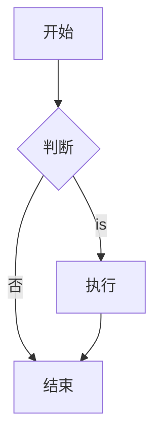

# Markdown syntax

Markdown is a lightweight markup language for formatting text. It is simple, easy to learn, and widely used for documents, blogs, and forums.

## Basic Syntax

### Headings

```markdown
# 一级title
## 二级title
### 三级title
#### 四级title
##### 五级title
###### 六级title
```

### Emphasis

```markdown
*斜体* 或 _斜体_
**粗体** 或 __粗体__
***粗斜体*** 或 ___粗斜体___
~~Removed线~~
```

Rendered output: *italic*, **bold**, ***bold italic***, ~~strikethrough~~

### list

#### Unordered lists

```markdown
- 项目1
- 项目2
  - 子项目2.1
  - 子项目2.2
- 项目3

* 也可以用星号
+ 或者加号
```

#### Ordered lists

```markdown
1. 第一项
2. 第二项
3. 第三项
   1. 子项3.1
   2. 子项3.2
```

### Link

```markdown
[Link文本](https://example.com)
[带title's Link](https://example.com "鼠标悬停显示")

# 自动Link
<https://example.com>
<email@example.com>

# Reference式Link
[Link文本][ref]
[ref]: https://example.com
```

### Images

```markdown


# 图片Link
[](https://example.com)
```

### Blockquotes

```markdown
> 这is一段Reference
> 可以有多行

> 多级Reference
>> 第二级
>>> 第三级
```

### Code

#### Inline code

```markdown
使用 `反引号` Package裹代码
```

#### Code blocks

````markdown
```python
def hello():
    print("Hello World")
```

```javascript
console.log("Hello World");
```
````

### Horizontal rules

```markdown
---
***
___
```

---

### Tables

```markdown
| Left aligned | Centered | Right aligned |
|:-------|:----:|-------:|
| Content 1 | Content 2 | Content 3 |
| 内容4  | 内容5 | 内容6 |
```

| Left aligned | Centered | Right aligned |
|:-------|:----:|-------:|
| Content 1 | Content 2 | Content 3 |

### Task lists

```markdown
- [x] FinishedTask
- [ ] Unfinished task
- [ ] 另aTask
```

- [x] FinishedTask
- [ ] Unfinished task

### Footnotes

```markdown
这is一段文字[^1]

[^1]: 这is脚注内容
```

## Github Flavored Markdown (GFM)

GitHub extends Markdown with several extra features.

### Syntax highlighting

````markdown
```python
def hello():
    print("Hello")
```
````

### Emoji

```markdown
:smile: :heart: :+1: :rocket:
```

:smile: :heart: :+1: :rocket:

[Emoji list](https://github.com/ikatyang/emoji-cheat-sheet)

### @mentions and issue references

```markdown
@username
#123
```

### Automatic links

GitHub automatically converts URLs into links:
```markdown
https://github.com
```

### Diff code blocks

````markdown
```diff
- Removed line
+ Added line
```
````

### Collapsible content

```markdown
<details>
<summary>点击展开</summary>

This is hidden content

</details>
```

### Alert boxes (newer GitHub feature)

```markdown
> [!NOTE]
> Useful information users should know.

> [!TIP]
> Suggestions that help users succeed.

> [!IMPORTANT]
> Critical information for successful use.

> [!WARNING]
> Urgent information that needs immediate attention.

> [!CAUTION]
> Potential negative consequences of an action.
```

### Mathematical formulas

Use LaTeX syntax:

```markdown
行内公式：$E = mc^2$

块级公式：
$$
\sum_{i=1}^{n} i = \frac{n(n+1)}{2}
$$
```

### Mermaid diagrams

````markdown

````

## Advanced tips

### HTML embedding

Markdown also supports raw HTML directly:

```markdown
<div align="center">
  
</div>

<kbd>Ctrl</kbd> + <kbd>C</kbd>

<mark>高亮文本</mark>
```

### Escaping characters

Use backslashes to escape special characters:

```markdown
\* 不is斜体
\# 不istitle
\[ 不isLink
```

### Anchor links

```markdown
[跳转到title](#titlename)

# Chinese title会被转为拼音或其他形式
```

### Badges

```markdown


```

### Table of contents

```markdown
[TOC]

# 某些Editor Supportautomatically generates目录
```

## Common tools

- **Editors**: Typora, VS Code, Obsidian
- **Online editors**: StackEdit, Dillinger
- **Formatting**: Prettier, markdownlint
- **Conversion**: Pandoc (Markdown to PDF/Word/HTML)

## Best Practices

1. **Keep it simple**: Markdown works best when it stays lightweight.
2. **Use headings well**: keep the hierarchy clear.
3. **Use code highlighting**: specify languages for better readability.
4. **Optimize images**: keep image sizes under control.
5. **Preview often**: check the rendered result after writing.
6. **Version control**: Markdown works very well with Git.
7. **Check links**: make sure all links work.

## References

- [Markdown Guide](https://www.markdownguide.org/)
- [GitHub Markdown documentation](https://docs.github.com/zh/get-started/writing-on-github)
- [CommonMark Specification](https://commonmark.org/)
- [Markdown Cheatsheet](https://github.com/adam-p/markdown-here/wiki/Markdown-Cheatsheet)